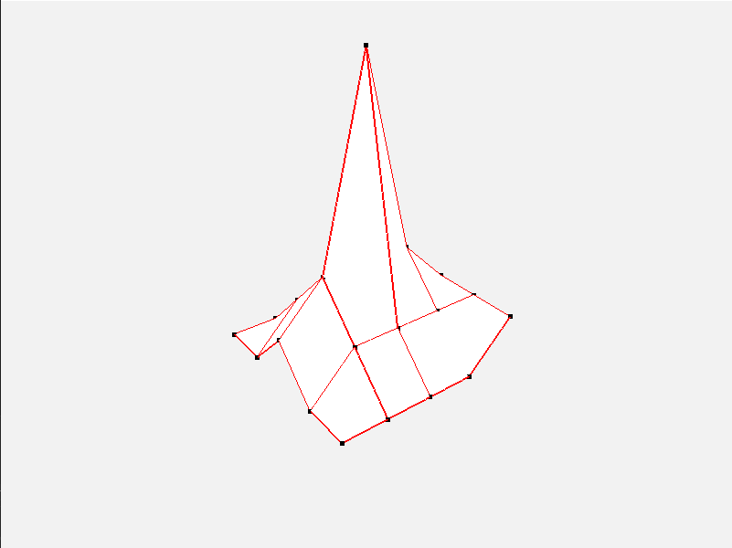
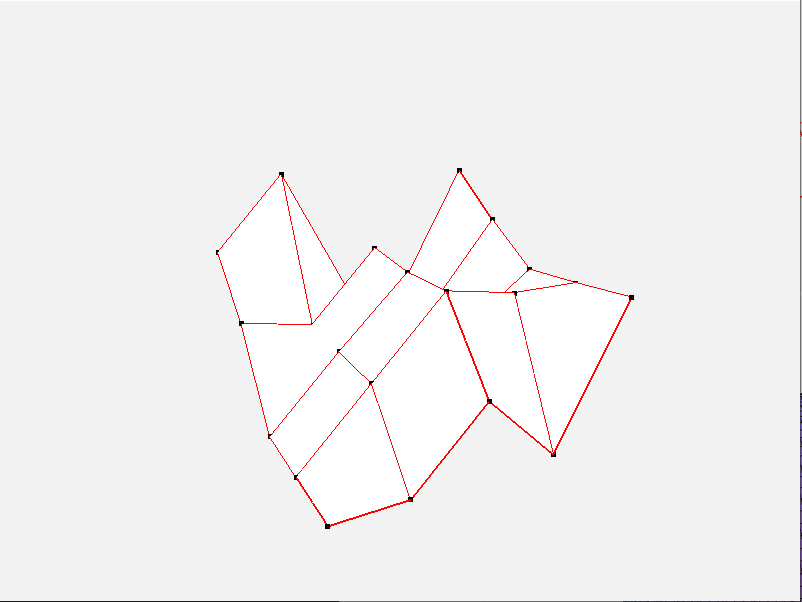
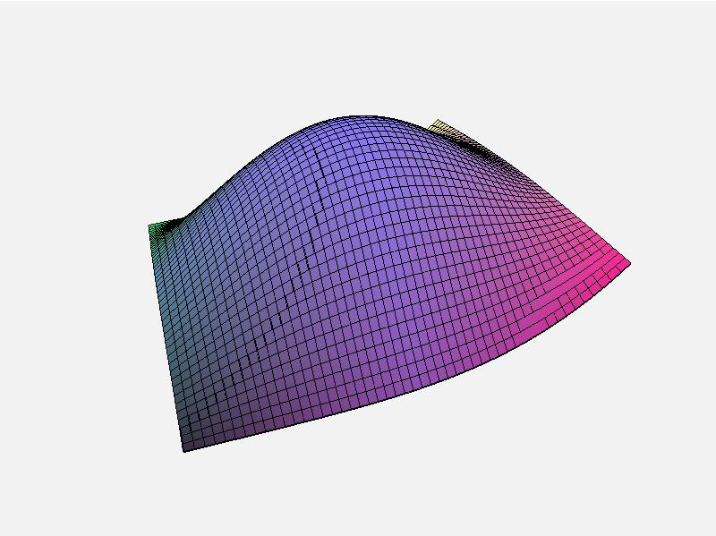
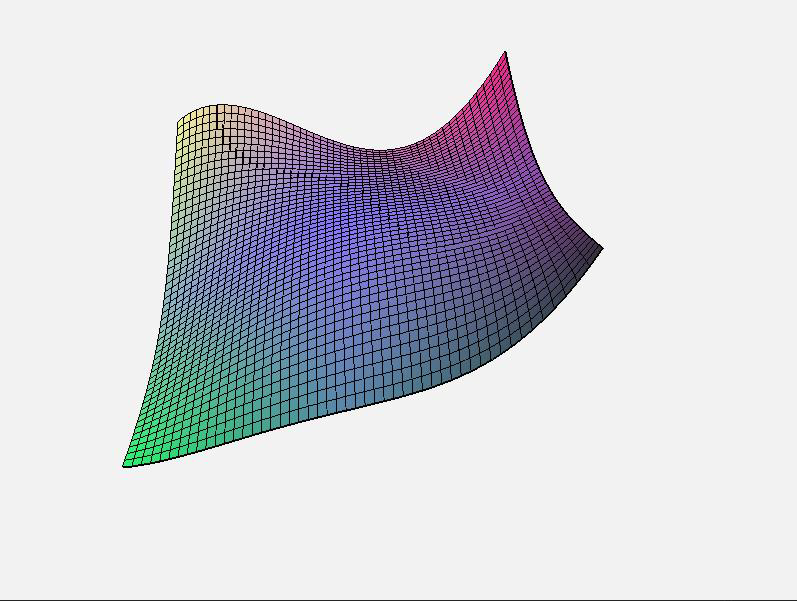

# BezierMeshOpenGL

**BezierMeshOpenGL** to aplikacja wykorzystująca bibliotekę OpenGL do renderowania i edycji powierzchni Béziera w przestrzeni 3D. Program umożliwia interaktywną manipulację punktami kontrolnymi oraz płynne wyświetlanie siatek kontrolnych i wygładzonych powierzchni w czasie rzeczywistym.

## Główne funkcje

- Renderowanie powierzchni Béziera i siatek kontrolnych na podstawie siatki 5x5 punktów kontrolnych
- Interaktywna edycja punktów kontrolnych za pomocą myszy
- Dynamiczne odświeżanie powierzchni po każdej modyfikacji
- Sterowanie kamerą (klawisze W, A, S, D) i obracanie widoku myszą
- Płynne przybliżanie i oddalanie za pomocą scrolla
- Tryby wyświetlania: widok siatki lub pełna powierzchnia z kolorowym gradientem
- Wykorzystanie nowoczesnych shaderów i transformacji macierzowych w OpenGL
- Efektywny rendering dzięki dynamicznemu zarządzaniu buforami

## Technologie

- **C++**
- **OpenGL 3.3+**
- **GLFW** – obsługa okna i wejścia
- **GLAD** – ładowanie funkcji OpenGL
- **GLM** – operacje na wektorach i macierzach
- **Shader Language (GLSL)** – własne shadery do renderowania siatek i powierzchni

## Sterowanie

| Akcja                       | Klawisz / Mysz             |
|----------------------------|----------------------------|
| Ruch kamery                | W / A / S / D              |
| Obracanie kamery           | Prawy przycisk myszy       |
| Przesuwanie punktów        | Lewy przycisk myszy (w trybie edycji) |
| Zmiana przybliżenia        | Scroll myszy               |
| Przełączenie trybu edycji  | Klawisz `E`                |
| Przełączenie widoku siatki / powierzchni | Klawisz `B`          |

## Zrzuty ekranu

Edycja siatki za pomocą myszy

Wizualizacja powierzchni Beziera

